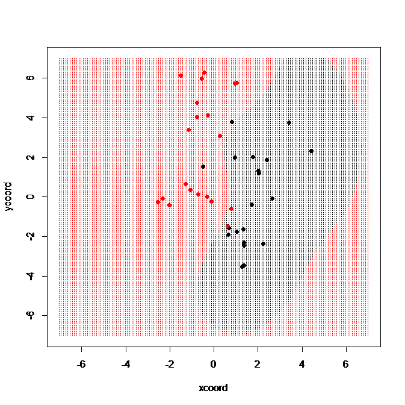

# Boundary Demo
Akinori Ito, 2017/6/13

This program is a collection of demonstration program displaying classification boundaries of various 
classifiers, such as the linear classifier, SVM, decision tree, random forests and neural network.

## Requirements
This program uses the following R packages:
* kernlab
* rpart
* randomForest
* nnet

## Usage
### lindemo()
Display the boundaries of the linear classifier.

### svmdemo(kernel, kpar)
Display the boundaries of SVM classifier. The arguments _kernel_ and _kpar_ are type of kernel and its parameters that 
are given to ksvm().

### dtdemo(control)
Display the boundaries of the decision tree classifier. 
The argument _control_ is the option list given to rpart().

### rfdemo(ntree)
Display the boundaries of the random forests.
The argument _ntree_ is the number of decision trees.

### nndemo(size)
Display the boundaries of the three-layer feed-forward neural network.
The argument _size_ is number of hidden units.
